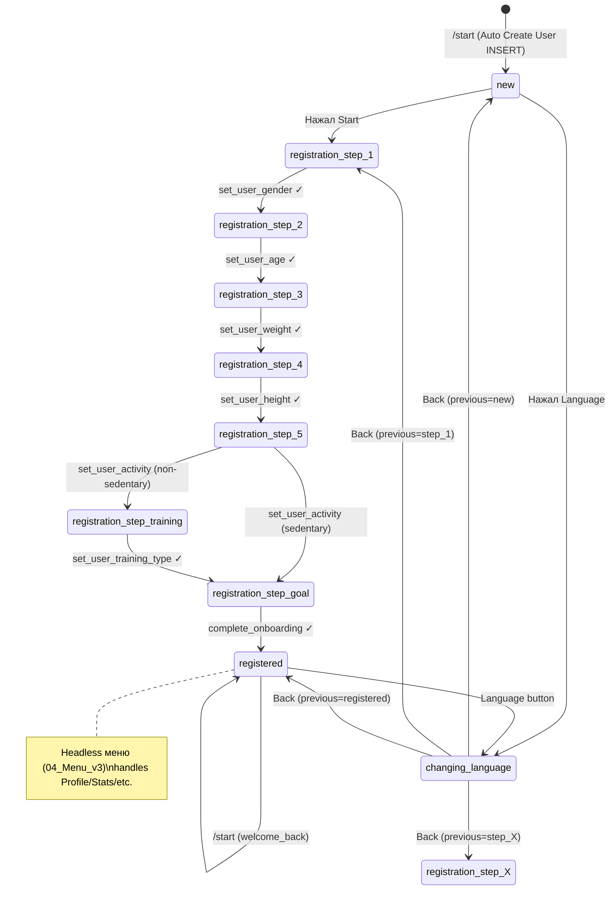

# 02_Onboarding_v3 — карта для миграции на Headless + Python

> Подготовлено chip разведки для следующего этапа (миграция в `handlers/onboarding.py` + `ui_screens`).
> Дата: 2026-04-29. Источник: GET workflow `wzjYmMOurCbp4czk` + SELECT из Supabase + чтение `dispatcher/router.py`.

## 1. FSM — состояния и переходы

| status (`users.status`) | trigger | условие | следующий status | RPC вызов |
|---|---|---|---|---|
| *(нет юзера в БД)* | `/start` | новый телеграм_id | `new` | **Auto Create User** (Supabase INSERT, делает 01_Dispatcher, не RPC) |
| `new` | `/start` или любой текст | status=`new` | `new` | — (показывает Welcome экран) |
| `new` | кнопка `icon_start Start` | isStartButton | `registration_step_1` | UPDATE users SET status |
| `new` | кнопка `icon_lang Language` | isLangButton | `changing_language` (previous=`new`) | UPDATE users SET status |
| `changing_language` | flag emoji (`🇬🇧`…`🇮🇷`) | isLangFlag | *(возврат к previous_status)* | Save Language DB (Supabase UPDATE language_code + status) → Fetch Translations |
| `changing_language` | `icon_back Back` | isBack | *(return to previous_status)* | UPDATE status (status_and_send) |
| `changing_language` | нераспознанный текст | — | `changing_language` (без смены) | — (переспросить lang picker) |
| `registration_step_1` | `cmd_select_male` / `cmd_select_female` | cbQuery starts `cmd_select_` | `registration_step_2` | `set_user_gender(p_telegram_id, p_input_text)` |
| `registration_step_1` | любой текст | fallback | `registration_step_1` | — (переспросить gender) |
| `registration_step_2` | числовой текст | NUMERIC_INPUT_STATUSES | `registration_step_3` | `set_user_age(p_telegram_id, p_input_text)` |
| `registration_step_3` | числовой текст | NUMERIC_INPUT_STATUSES | `registration_step_4` | `set_user_weight(p_telegram_id, p_input_text)` |
| `registration_step_4` | числовой текст | NUMERIC_INPUT_STATUSES | `registration_step_5` | `set_user_height(p_telegram_id, p_input_text)` |
| `registration_step_5` | `cmd_select_{sedentary\|light\|moderate\|heavy}` | cbQuery starts `cmd_select_` | `registration_step_training` ИЛИ `registration_step_goal` | `set_user_activity(p_telegram_id, p_activity_text)` |
| `registration_step_5` | любой текст | fallback | `registration_step_5` | — (переспросить activity) |
| `registration_step_training` | `cmd_select_{strength\|cardio\|mixed\|training_skip}` | cbQuery starts `cmd_select_` | `registration_step_goal` | `set_user_training_type(p_telegram_id, p_training_text)` |
| `registration_step_training` | любой текст | fallback | `registration_step_training` | — (переспросить training) |
| `registration_step_goal` | `cmd_select_{lose\|maintain\|gain}` | cbQuery starts `cmd_select_` | **COMPLETION** → `registered` | `complete_onboarding(p_telegram_id, p_goal_text)` |
| `registration_step_goal` | любой текст | fallback | `registration_step_goal` | — (переспросить goal) |
| **COMPLETION** | — | rpc=complete_onboarding | `registered` | `complete_onboarding` внутри вызывает `set_user_goal` → `grant_xp` → `grant_nomscoins` → `grant_registration_mana` → (если referrer) `activate_trial` |
| `registered` | `/start` | isStartCommand && status=`registered` | `registered` | — (показывает welcome_back + main menu) |

### Ветвление на шаге 5 (Activity):
- Sedentary → `registration_step_goal` (пропускает training, auto-sets training=`sedentary`)
- Light/Moderate/Heavy → `registration_step_training`

### Ветвление на completion (Goal):
- Lose/Gain → `complete_onboarding` завершает регистрацию; статус `registered` (скорость goal_speed отдельно через `edit_speed`)
- Maintain → `complete_onboarding`, статус `registered`

### Edit-flows (обрабатываются в том же workflow, routing через `dispatcher/router.py` → target `onboarding`):
| status | trigger | RPC | следующий status |
|---|---|---|---|
| `edit_gender` | `cmd_select_*` | `set_user_gender` | `registered` |
| `edit_age` | числовой текст | `set_user_age` | `registered` |
| `edit_weight` | числовой текст | `set_user_weight` | `registered` |
| `edit_height` | числовой текст | `set_user_height` | `registered` |
| `edit_activity` | `cmd_select_*` | `set_user_activity` | `registered` |
| `edit_training` | `cmd_select_*` | `set_user_training_type` | `registered` |
| `edit_goal` | `cmd_select_*` | `set_user_goal` | `registered` или `edit_speed` (если lose/gain) |
| `edit_speed` | `cmd_speed_{slow\|normal\|fast}` | `set_user_goal_speed` | `registered` |
| `edit_phenotype` | — | *(только показывает экран)* | `registered` |
| `edit_training`, `edit_speed`, `edit_phenotype` | `cmd_back` | — (status_and_send) | `registered` |

### Changing_language из registration steps (Back):
При `changing_language` + isBack → `return_status = previous_status` → для `registration_step_*` показывает заново вопрос этого шага. Для `registered` → Settings экран.

---

## 2. Граф (mermaid)

---

## 3. RPC-вызовы (полный список)

| RPC | Параметры | На каком шаге | Что возвращает |
|---|---|---|---|
| `set_user_gender` | `p_telegram_id BIGINT, p_input_text TEXT` | step_1 / edit_gender | `{success, value, next_status}` |
| `set_user_age` | `p_telegram_id BIGINT, p_input_text TEXT` | step_2 / edit_age | `{success, next_status}` или `{success:false, error_key}` |
| `set_user_weight` | `p_telegram_id BIGINT, p_input_text TEXT` | step_3 / edit_weight | `{success, next_status}` или `{success:false, error_key}` |
| `set_user_height` | `p_telegram_id BIGINT, p_input_text TEXT` | step_4 / edit_height | `{success, next_status}` или `{success:false, error_key}` |
| `set_user_activity` | `p_telegram_id BIGINT, p_activity_text TEXT` | step_5 / edit_activity | `{success, activity_key, next_status, training_type}` |
| `set_user_training_type` | `p_telegram_id BIGINT, p_training_text TEXT` | step_training / edit_training | `{success, training_type, next_status}` |
| `complete_onboarding` | `p_telegram_id BIGINT, p_goal_text TEXT` | step_goal → completion | `{success, goal_type, calculations, macros, xp_gained, leveled_up, coins_granted, mana_current, mana_gift, trial_activated, subscription_status}` |
| `set_user_goal` | `p_telegram_id BIGINT, p_goal_text TEXT` | edit_goal | `{success, goal_type, next_status, calculations, macros}` |
| `set_user_goal_speed` | `p_telegram_id BIGINT, p_speed TEXT` | edit_speed | `{success, goal_speed, new_calories}` |
| `push_nav` | `p_telegram_id BIGINT, p_screen TEXT` | после Response Builder (если `_push_nav_screen` в payload) | nav_stack обновление |
| `sync_user_profile` | `p_telegram_id BIGINT, p_first_name TEXT, p_username TEXT` | fire-and-forget при каждом Update (webhook_server.py) | — |
| `process_referral_join` | `p_referred_id BIGINT, p_referrer_id BIGINT` | при /start с ref_XYZ (нужно реализовать в handler) | `{success}` или `{error: SELF_REFERRAL/ALREADY_REFERRED}` |
| `restore_user_account` | `p_telegram_id BIGINT` | restore_execute flow (dispatcher/router.py → отдельный handler) | `{success}` или `{error}` |

### Примечание: User creation
Пользователи создаются в `01_Dispatcher` (n8n) через `Auto Create User` (Supabase INSERT), НЕ через RPC. В Python замене — надо делать `INSERT INTO users ... ON CONFLICT DO NOTHING` или отдельную RPC `ensure_user_exists`. Telegram `language_code` (из `from.language_code`) нормализуется к поддерживаемым 13 языкам при создании; если не поддерживается — `en`.

---

## 4. Экраны

### 4.1 Уже в `ui_screens` (переиспользуем)

Эти экраны существуют для **edit-flow из Profile v5**, но их `save_rpc` и `next_on_submit` настроены на возврат в `personal_metrics` (не в онбординг). В онбординге нужно **другое** `next_on_submit` (→ следующий шаг регистрации), поэтому их переиспользовать напрямую нельзя — нужны отдельные онбординговые версии ИЛИ handler определяет куда идти по текущему `status`.

| screen_id | render_strategy | text_key | save_rpc | next_on_submit (edit-mode) |
|---|---|---|---|---|
| `ask_age` | replace_existing | `questions.age` | `set_user_age` | `personal_metrics` |
| `ask_height` | replace_existing | `questions.height` | `set_user_height` | `personal_metrics` |
| `ask_weight` | replace_existing | `questions.weight` | `set_user_weight` | `personal_metrics` |

**Вывод:** Эти экраны можно переиспользовать в онбординге если handler сам определяет `next_on_submit` по `users.status`, а не читает из `ui_screens`. Т.е. RPC (`set_user_age` etc.) возвращает `next_status` в ответе — handler читает оттуда, игнорируя `ui_screens.next_on_submit`. Это уже так работает в n8n Response Builder.

### 4.2 Нужно создать (новые `ui_screens` для онбординга)

| Предлагаемый screen_id | render_strategy | Описание | Кнопки | Translation keys |
|---|---|---|---|---|
| `onboarding_welcome` | send_new | Welcome-экран для новых пользователей | Reply-KB: `[icon_start Start]`, `[icon_lang Language]` | `onboarding.welcome`, `buttons.start`, `buttons.language` |
| `onboarding_lang_picker` | send_new | Выбор языка | Reply-KB: 13 флагов + Back | *(захардкожены флаги + `buttons.back`)* |
| `onboarding_ask_gender` | send_new | Выбор пола | Inline: `[icon_male Male]`, `[icon_female Female]` | `questions.gender`, `answers.male`, `answers.female` |
| `onboarding_ask_age` | send_new | Ввод возраста | Reply-KB: только `[icon_lang Language]` | `questions.age` |
| `onboarding_ask_weight` | send_new | Ввод веса | Reply-KB: только `[icon_lang Language]` | `questions.weight` |
| `onboarding_ask_height` | send_new | Ввод роста | Reply-KB: только `[icon_lang Language]` | `questions.height` |
| `onboarding_ask_activity` | send_new | Выбор активности | Inline: 4 варианта (sedentary/light/moderate/heavy) | `questions.activity`, `answers.act_*` |
| `onboarding_ask_training` | send_new | Выбор типа тренировок | Inline: strength/cardio/mixed/skip | `questions.training_type`, `answers.train_*` |
| `onboarding_ask_goal` | send_new | Выбор цели | Inline: lose/maintain/gain | `questions.goal`, `answers.goal_*` |
| `onboarding_success` | send_new | Экран завершения (2 сообщения) | Inline CTA: Add food + Reply main menu | `onboarding.finished`, `gamification.onboarding_mana` ⚠️ + `onboarding_success.menu_hint` |
| `onboarding_welcome_back` | send_new | `/start` для зарегистрированного | Reply main menu | `onboarding.msg_welcome_back` ⚠️ (НЕ СУЩЕСТВУЕТ) |

⚠️ Новые ключи — нужно добавить в `ui_translations` для всех 13 языков.

**Примечание:** Архитектура `ui_screens` с `render_screen` RPC подходит для Headless-рендера, но онбординг — **stateful FSM**, поэтому большинство экранов разумнее строить как Python dict'ы в `handlers/onboarding.py`, а не как строки в `ui_screens`. SQL-таблица `ui_screens` нужна только для экранов которые уже там есть (edit profile) или будущего Config-driven UI v4.

---

## 5. Edge cases

### Deep-link `/start ref_XYZ`
- **Сейчас (n8n):** `01_Dispatcher` ловит `/start ref_XYZ` через regex, кладёт `parsed_referrer_id` в Prepare-ноду. При уже зарегистрированном юзере — показывает main menu (не обрабатывает реферал повторно). При новом — создаёт юзера (Auto Create User) с `referrer_id = NULL` пока. Реальная привязка через `process_referral_join` происходит... **неочевидно** — нода не найдена в 02_Onboarding_v3 и нет явного вызова.
- **Python dispatcher:** `router.py` извлекает `parsed_referrer_id = int(match.group(1))` из `/start ref_NNN` для target=`onboarding` или target=`restore_choice`.
- **Вывод:** `process_referral_join` вызывается где-то в 01_Dispatcher или нигде явно. `complete_onboarding` читает `users.referrer_id` и если != NULL — вызывает `activate_trial`. Значит при создании юзера `referrer_id` уже должен быть записан. **Нужно уточнить** — найти ноду в 01_Dispatcher которая пишет `referrer_id` при Auto Create User.
- **Риск:** Если `referrer_id` не записывается при создании пользователя, реферальные трайалы не работают. Это нужно проверить отдельно.

### Повторный `/start` (status=`registration_completed` / `registered`)
- Onboarding Engine ветка: `if (isStartCommand) { if (status === 'registered') { show welcome_back + main menu KB } else { show Welcome screen (new status) } }`
- Перевода `messages.welcome_back` НЕТ в `ui_translations` — используется `d.messages?.welcome_back || '👋'`. **⚠️ Нужно добавить** этот ключ во все 13 языков.

### Soft-delete recovery
- Обрабатывается **НЕ** в `02_Onboarding_v3`, а в `dispatcher/router.py` (target=`restore_choice`) и отдельном хандлере.
- При `/start` с `deleted_at IS NOT NULL` → target=`restore_choice` (Python router) → должен показать экран с кнопками [Восстановить аккаунт] / [Начать заново]
- `cmd_restore_account` → `restore_user_account(p_telegram_id)` → status='registered'
- `cmd_start_fresh` → отдельная логика (предположительно: очистка данных + ресет статуса)
- **Экраны restore_choice НЕ в ui_screens** (там только `delete_account_confirm`). Нужно создать `restore_choice` экран.

### Language pre-selection при создании
- Auto Create User в 01_Dispatcher берёт `from.language_code` из Telegram, нормализует к 13 поддерживаемым языкам (fallback: `en`). Это сразу записывается в `users.language_code`.
- В онбординге пользователь видит интерфейс уже на своём языке (из `v_user_context → translations`).
- Явный выбор через `icon_lang` кнопку переопределяет auto-detection.

### Premium skip-flow
- Не обнаружено в `02_Onboarding_v3`. Premium-флаг не проверяется в Onboarding Engine.
- `complete_onboarding` автоматически активирует trial для referred users (`activate_trial(p_telegram_id, 'referral')`).
- Неочевидно: есть ли skip-шагов для пользователей с уже активной подпиской. По коду — нет.

### Прерванный онбординг (resume)
- Если юзер закрыл бота на `registration_step_3`:
  - При следующем `/start` → Onboarding Engine: `isStartCommand && status != 'registered'` → ставит `status='new'`, показывает Welcome экран.
  - То есть прогресс НЕ сохраняется — юзер начинает с нуля (Welcome → Start → шаги).
  - Данные (age/weight/height) которые были введены ранее — остаются в БД, но юзеру не показываются.
- **Примечание:** `/start` всегда сбрасывает к `status='new'` если пользователь не `registered`. Это намеренное поведение.
- **Исключение:** Если юзер нажимает НЕ `/start`, а reply-кнопку шага (например Language flag или Back) — продолжает с текущего статуса.

---

## 6. Welcome sticker

- **file_id:** НЕ найден в `02_Onboarding_v3` (ни одной sendSticker ноды в workflow, 17 нод — ни одна не шлёт стикер).
- `processing_sticker_id` в `app_constants` — пустая строка (`''`). Используется `telegram_proxy.py` для `maybe_send_indicator`, не для приветствия.
- Стикеры хранятся в таблице `bot_stickers` (категория `processing`). Онбординговых стикеров там нет.
- **Вывод:** Welcome-стикер при регистрации не используется в текущей реализации. Возможно был ранее в legacy `02_Onboarding` v1.

### Предложение для миграции:
- Python `webhook_server.py` на `/start` — fire-and-forget `sendChatAction(typing)` (не стикер, т.к. file_id нет)
- Сразу следом без задержки — `handlers/onboarding.py` рендерит Welcome экран через `services/telegram_send.py`
- Если welcome стикер нужен — добавить `bot_stickers` запись категории `onboarding_welcome`, читать из кэша в `telegram_proxy.py`

---

## 7. Риски и неизвестные

1. **Реферал при создании пользователя:** Неясно где `referrer_id` записывается в `users` при первом `/start ref_XYZ`. Нода `Auto Create User` в 01_Dispatcher не включает `referrer_id` в INSERT. Возможно записывается отдельной нодой которую мы не нашли (надо проверить 01_Dispatcher детально). Без этого `complete_onboarding` не выдаст trial.

2. **`messages.welcome_back` отсутствует** в `ui_translations` (все 13 языков). При повторном `/start` бот показывает `'👋'`. Нужно добавить переводы.

3. **`gamification.onboarding_xp` и `gamification.onboarding_coins` отсутствуют** в `ui_translations` (все 13 языков). В Response Builder используется fallback `c.xp_onboarding_complete` из `app_constants` (= 50). Mana key существует (`gamification.onboarding_mana`).

4. **`onboarding_success.personality_text` отсутствует** — ключ используется в Response Builder при completion (`os.personality_text || ''`), но в `ui_translations` `onboarding_success` содержит только `menu_hint`. Текст просто пустой — не критично, но UX неполный.

5. **edit_gender**, **edit_activity** роутятся через `dispatcher/router.py` в `onboarding` (т.к. `status in PROFILE_V5_STATUSES`? — нет, `edit_gender` и `edit_activity` НЕ в `PROFILE_V5_STATUSES`). Нужно проверить: `edit_gender` → target=`menu_v3` или `onboarding`? По коду router.py ветка 4e: `PROFILE_V5_STATUSES = {edit_weight, edit_age, edit_height, edit_goal, edit_activity, edit_training, edit_speed, edit_gender, ...}` — ВСЕ edit-статусы идут в `menu_v3`. А `02_Onboarding_v3` обрабатывает их через `go to 02.1` (location) или через Generic RPC — значит Onboarding_v3 сейчас НЕ принимает edit-статусы напрямую через main dispatch. **Edit-flow уже мигрирован в menu_v3!** `02_Onboarding_v3` обрабатывает edit-статусы только если попадает через legacy path. Для Python замены — edit-статусы идут в `handlers/profile_edit.py`, не в `handlers/onboarding.py`.

6. **Completion дублирует 2 сообщения:** Response Builder возвращает 2 JSON-объекта (payload1 + payload2). В Python нужно отправить оба последовательно (или через `extra_items` в render response).

7. **`changing_language` → `registered` Back → показывает Settings экран** (inline KB с cmd_edit_lang, cmd_edit_country, cmd_edit_timezone, cmd_delete_account, cmd_back). Это полный Settings экран. В Python нужна либо headless render для `settings`, либо аналог. **Settings уже в Headless** (migr 145+), просто вызвать `render_screen('settings', ...)`.

8. **`onboarding:country` / `onboarding:timezone`** — статусы которые роутятся в `location` (Go to 02.1 workflow). В Python это отдельный `handlers/location.py`, уже существует `02.1_Location` workflow (`7EqiiwUwlGs7dcHT`).

---

## 8. Зависимости

### Новые `app_constants` (не нужны — все существуют):
- `icon_start ▶️`, `icon_lang 🌐`, `icon_back 🔙`, `icon_male 👨`, `icon_female 👩`
- `icon_age 🎂`, `icon_weight ⚖️`, `icon_height 📏`
- `icon_celebration 🎉`, `icon_goal 🎯`, `icon_stats 📊`
- `icon_protein 🥩`, `icon_fat 🥑`, `icon_carbs 🥖`, `icon_mana 🧪`, `icon_down 👇`
- `xp_onboarding_complete = 50`, `coins_registration_bonus = 50`, `mana_gift_registration = 5`
- `credits_after_registration = 5`

### Отсутствующие translation keys (нужно добавить для всех 13 языков):

| Ключ | Существует? | Примечание |
|---|---|---|
| `messages.welcome_back` | ❌ НЕТ | Текст приветствия при повторном /start |
| `gamification.onboarding_xp` | ❌ НЕТ | "+50 XP" строка в completion |
| `gamification.onboarding_coins` | ❌ НЕТ | "+50 coins" строка в completion |
| `gamification.onboarding_mana` | ✅ ЕСТЬ | "{icon_mana} {mana} Mana — welcome gift!" |
| `onboarding.welcome` | ✅ ЕСТЬ | Основной welcome text |
| `onboarding.finished` | ✅ ЕСТЬ | Title completion экрана |
| `onboarding_success.menu_hint` | ✅ ЕСТЬ | Hint под main menu |
| `questions.gender/age/weight/height/activity/training_type/goal` | ✅ ЕСТЬ | |
| `answers.male/female/act_*/goal_*/train_*/speed_*` | ✅ ЕСТЬ | |
| `buttons.start/language/back` | ✅ ЕСТЬ | |

### Колонки `users` затрагиваются онбордингом:
`telegram_id`, `first_name`, `username`, `language_code`, `status`, `previous_status`, `gender`, `birth_date`, `weight_kg`, `height_cm`, `activity_level`, `training_type`, `goal_type`, `goal_speed`, `phenotype`, `referrer_id`, `nav_stack`

### Существующие RPC переиспользуем (все есть в БД):
- `set_user_gender`, `set_user_age`, `set_user_weight`, `set_user_height`
- `set_user_activity`, `set_user_training_type`, `set_user_goal`, `set_user_goal_speed`
- `complete_onboarding`
- `push_nav`
- `sync_user_profile`
- `process_referral_join`
- `restore_user_account`

### НЕ существует (нужно создать или уточнить):
- `ensure_user_exists` — нет в БД. При Python замене 01_Dispatcher нужна RPC или Python INSERT ON CONFLICT для создания пользователя при первом `/start`.
- Welcome стикер `file_id` — нет нигде. Решить: добавить в `bot_stickers` или не использовать.

## Related Concepts

- [[concepts/onboarding-v3-map-supplement]] — Pre-implementation audit (Block 1-4): `ensure_user_exists` контракт, точная логика `Auto Create User`, колонки users
- [[concepts/phase4-onboarding-migration]] — итоги cutover (миграции 161+170, 9 gotchas)
- [[concepts/start-fresh-flow]] — `cmd_start_fresh` через `reset_to_onboarding` RPC
- [[concepts/variant-b-cutover]] — общий паттерн n8n→Python staged rollout
- [[concepts/python-vs-n8n-template-grammar]] — две грамматики шаблонов на одном `ui_translations`
